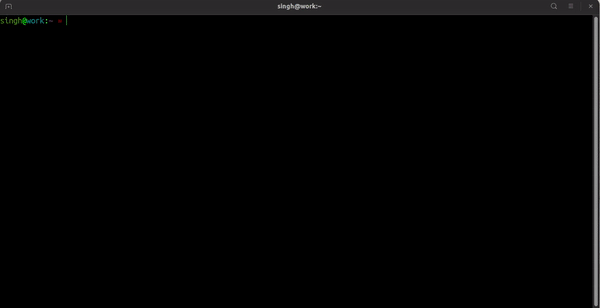

## WORKON_ROS

This tool was inspired by [virtualenvwrapper](https://virtualenvwrapper.readthedocs.io/en/latest/) which makes activating and managing virtual environments very easy.   
This script allows you to source setup.bash files for different ros distros or workspaces in a similar way and also displays the name of the current activated distro+workspace in the command prompt in parenthesis (as shown in gif below).
 It works with both ROS1 and ROS2 workspaces! 

>Note: The script assumes that you have installed all your ROS distros in default `/opt/ros` path

## Usage Instructions
* Add an environment variable named `WORKON_ROS_HOME` with the path containing workspaces to your `.bashrc` like this: 
  `export WORKON_ROS_HOME=$HOME/ros_workspaces`

* To source the `workon_ros_script.sh` shell script everytime you open a terminal, add the following to your `.bashrc` 
 `source /path/to/script/workon_ros_wrapper.sh`

* Source any distro or workspace using this command:
 `workon_ros distro_name/workspace_name`

## TO DO:
- [x] Tab Completion
- [x] Add help function and -h option
- [x] Add zsh support
- [ ] Add support for multiple `WORKON_ROS_HOME` paths.
- [ ] deactive_ros function 
- [x] Add `--change-directory` boolean option with workon_ros

